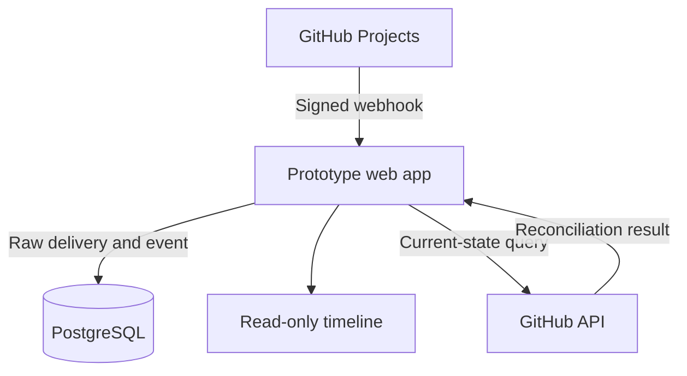

# Oryzn

**Trustworthy, immutable audit history for GitHub Projects.**

Oryzn is a GitHub App that captures Project V2 item field edits, preserves the original signed webhook evidence, normalizes each change, and displays a dependable read-only timeline—with reconciliation to prove nothing was lost or duplicated.

> Status: Lean MVP v0.1 — Prototype-ready

## Your Project changed. Can you prove what happened?

GitHub Projects shows the value *now*. It does not provide a dependable, permanent, user-friendly history for every field change. When a critical status, date, estimate, or iteration moves, teams are left asking:

- Who changed this field?
- What was its previous value?
- When did it change?
- Did an automation or a person change it?
- Can the team trust that the history is complete?

That uncertainty is the bug Oryzn is built to remove.

## The fix: one uncompromising loop

This is the product's heartbeat:

> **Signed webhook → durable raw delivery → normalized audit event → read-only timeline → reconciliation**

Oryzn verifies and stores the evidence first, then interprets it. Every supported edit becomes a typed, append-only event; the timeline makes it understandable; reconciliation compares Oryzn's current state with GitHub to expose drift.

The core promise:

> When someone changes a tracked field in the selected GitHub Project, the change appears **once—and only once** in the timeline with the correct Organization, Project, Project item, Field, Actor, Previous value, New value, Event timestamp, and a link back to the GitHub item.

## Why you can trust it

- **Authentic at the door:** every webhook is checked with HMAC-SHA256 signature verification using the unmodified body and a constant-time comparison.
- **Original evidence retained:** the full raw payload, delivery ID, headers, event name, action, receive time, and processing outcome remain available for recovery and debugging.
- **No redelivery duplicates:** `X-GitHub-Delivery` is a database-level unique idempotency key; each `audit_events.delivery_id` is unique.
- **Immutable history:** `audit_events` is append-only, with no application update or delete operations.
- **Honest ordering:** GitHub event time (`occurred_at`) and application receive time (`received_at`) are stored separately.
- **No invented identity:** unavailable actors, timestamps, titles, and field labels stay nullable rather than being fabricated.
- **Failures stay visible:** unsupported payloads and processing errors are preserved and surfaced—not buried in logs.
- **Drift gets caught:** reconciliation compares normalized GitHub state with `current_values` and records missing, changed, and unexpected values without manufacturing history.

## Built for the changes that matter

- **Field coverage:** single-select, text, number, date, and iteration.
- **Fast investigation:** filter by actor, item text, field, and date range.
- **An honest starting line:** baseline sync captures current values as a clearly labeled snapshot—never fake history for changes made before installation.
- **Delivery debugger:** inspect a raw delivery and its processing outcome through a protected route.
- **Reconciliation runs:** manually prove stored state matches GitHub and make mismatches explicit.
- **Clear value states:** removed values render as `Cleared`; unknown shapes render as `Unsupported value` and link to the delivery debugger.

### Proof targets, not vanity metrics

The prototype is successful only when it can capture **50 consecutive scripted changes with zero loss or duplicates**, display an accepted event within **10 seconds** under normal test conditions, reject invalid webhook signatures, and survive an application restart without losing stored events. It must also detect deliberately introduced reconciliation drift.

## Architecture: deliberately lean

One TypeScript web application. One PostgreSQL database. One public HTTPS deployment. No premature service split.



**Reference stack:** TypeScript, a single Node.js framework such as Next.js or Fastify, PostgreSQL, Octokit or another maintained GitHub App SDK, and server-rendered HTML or a minimal React UI.

### Canonical audit event

```json
{
  "event_id": "uuid",
  "delivery_id": "github-delivery-guid",
  "installation_id": 12345,
  "organization_login": "example-org",
  "project_node_id": "PVT_...",
  "project_item_node_id": "PVTI_...",
  "content_type": "Issue",
  "content_node_id": "I_...",
  "content_title": "Fix login timeout",
  "content_url": "https://github.com/example-org/example/issues/42",
  "field_node_id": "PVTF_...",
  "field_name": "Status",
  "field_type": "single_select",
  "previous_value": {
    "option_id": "option-1",
    "label": "In progress"
  },
  "current_value": {
    "option_id": "option-2",
    "label": "Done"
  },
  "actor_login": "octocat",
  "occurred_at": "2026-08-12T10:30:00Z",
  "received_at": "2026-08-12T10:30:02Z",
  "source": "github_webhook"
}
```

## API and routes

| Method | Route | Purpose |
|---|---|---|
| `POST` | `/api/github/webhooks` | Receive and verify GitHub App webhooks. |
| `GET` | `/events` | Render the audit timeline and filters. |
| `GET` | `/api/events` | Return paginated normalized events. |
| `POST` | `/internal/baseline-sync` | Snapshot the configured Project. Protected prototype route. |
| `POST` | `/internal/reconcile` | Compare current state with GitHub. Protected prototype route. |
| `GET` | `/internal/deliveries/:id` | Inspect one delivery and its processing outcome. Protected prototype route. |
| `GET` | `/health` | Check application and database liveness. |

## Status and scope

Oryzn is a **Lean MVP v0.1** with a **Prototype-ready** specification. The first proof is intentionally narrow: one GitHub organization, one organization-owned Project V2 board, and read-only access with organization `Projects: read` permission. Oryzn does not mutate GitHub data.

### What's intentionally out for MVP

- Rollback, GitHub mutations, and Project write permission
- Billing, subscriptions, trials, and GitHub Marketplace listing
- Multi-tenant isolation, self-service onboarding, teams, roles, invitations, SSO, and enterprise identity management
- Slack, email, anomaly alerts, scheduled reports, PDF evidence packages, and compliance framework mappings
- Configurable retention policies and repository issue history
- Reconstruction of pre-installation history and user-owned GitHub Projects

Rollback is a gated phase-two capability—not a shortcut in the prototype. Trustworthy capture, ordering, identity, and reconciliation come first.

### Quick start (once built)

The build sequence begins by creating a GitHub App with callback and webhook URLs, a webhook secret, a private key, organization `Projects: read` permission, and a `projects_v2_item` subscription. Runtime configuration then supplies the installation ID and target Project node ID; environment secrets supply the database URL and prototype administrator password.

Implementation and deployment commands will land with the application. Until then, the [full MVP specification](docs/GitHub_Projects_Audit_History_MVP_Spec.md) is the source of truth.

## Getting started

### Prerequisites

- Node.js 20 or newer
- PostgreSQL 16 or newer

Install dependencies and create your local environment file:

```sh
npm install
cp .env.example .env.local
```

Fill in the values in `.env.local`, then initialize the database and start the app:

```sh
npm run migrate
npm run dev
```

Visit `GET /api/health` to check application and database liveness. The GitHub App, its installation, and the target Project node ID are created manually on GitHub as part of [issue #2](https://github.com/anthonykewl20/oryzn/issues/2).

## Roadmap: earn rollback

Rollback work may begin only when:

- All MVP acceptance tests pass.
- Reconciliation consistently explains current-state drift.
- At least three pilot customers explicitly request restoration and will grant Project write access.
- The UX includes a preview and confirmation.
- Every mutation checks that GitHub's current value still equals the expected value.
- Every rollback creates a new audit event.
- Partial failures are visible and retryable.

The first rollback release will restore **one field on one item**—not attempt risky bulk rollback.

## Documentation

- [GitHub Projects Audit History — Lean MVP specification](docs/GitHub_Projects_Audit_History_MVP_Spec.md)

### Official GitHub references

- [GitHub: Webhook events and payloads](https://docs.github.com/webhooks/webhook-events-and-payloads)
- [GitHub: Using the API to manage Projects](https://docs.github.com/en/issues/planning-and-tracking-with-projects/automating-your-project/using-the-api-to-manage-projects)
- [GitHub: Validating webhook deliveries](https://docs.github.com/en/webhooks/using-webhooks/validating-webhook-deliveries)
- [GitHub: Webhook best practices](https://docs.github.com/en/webhooks/using-webhooks/best-practices-for-using-webhooks)
- [GitHub: Projects GraphQL mutations](https://docs.github.com/en/graphql/reference/projects)
- [GitHub Community: Project V2 webhook previous/current field values](https://github.com/orgs/community/discussions/17405)
- [GitHub Community: Request for custom-field change history](https://github.com/orgs/community/discussions/86690)

---

**Oryzn starts where trustworthy history starts: signed evidence, stored once, explained clearly.**
