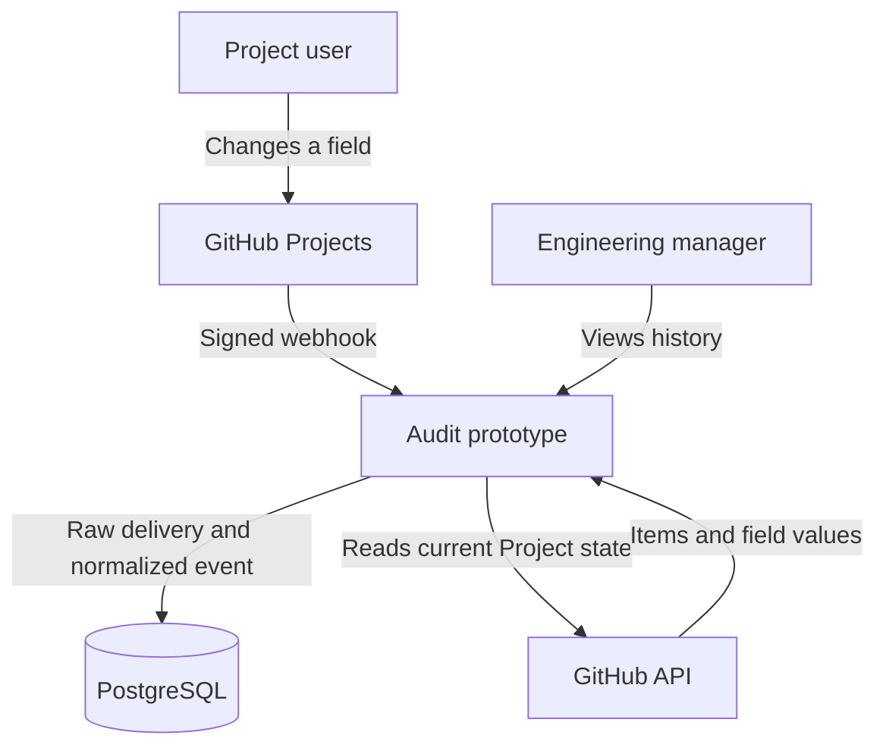
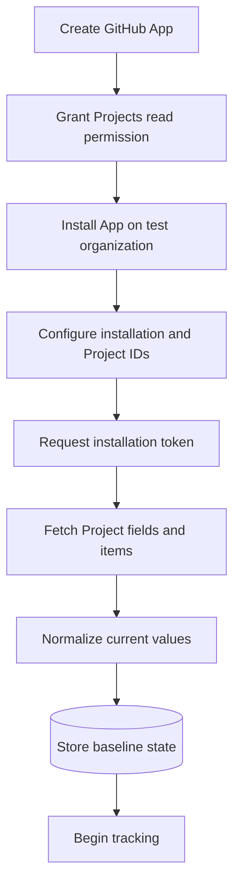
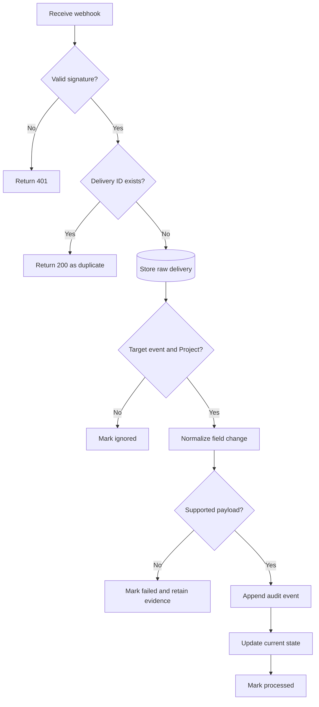
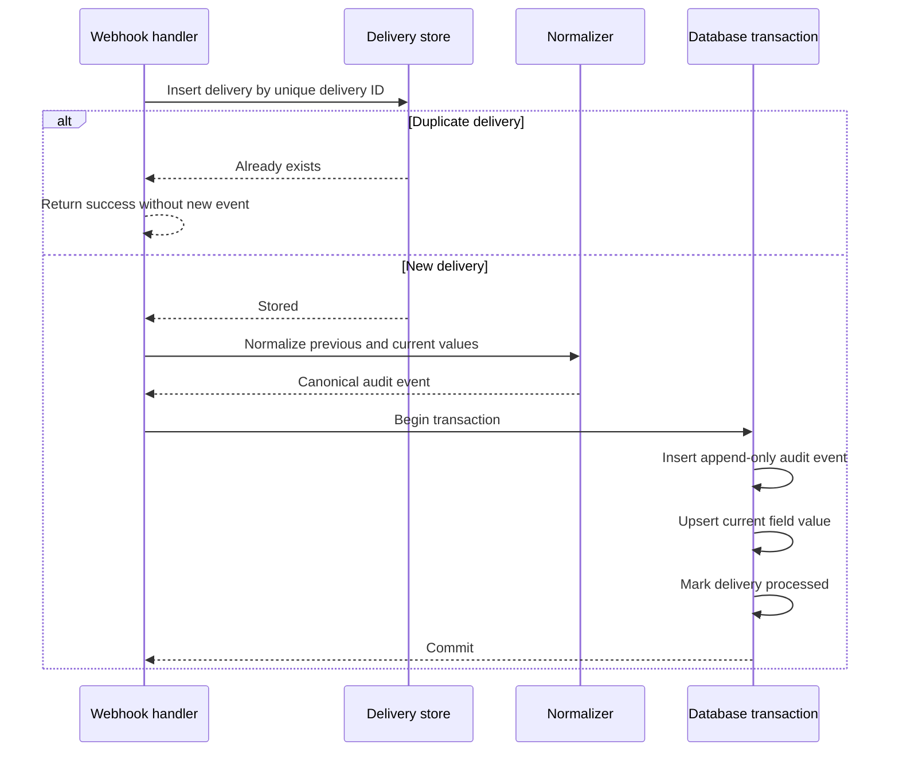
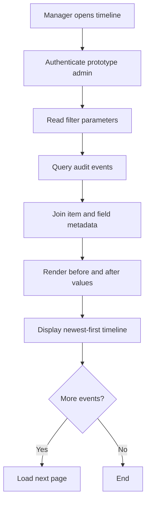
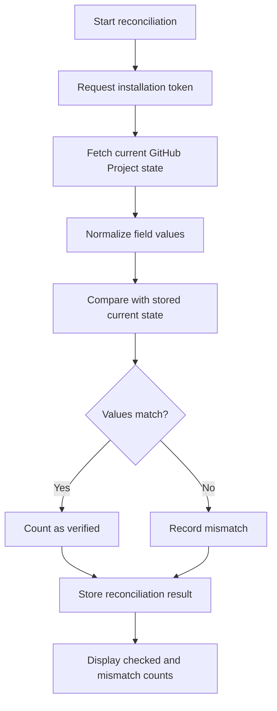
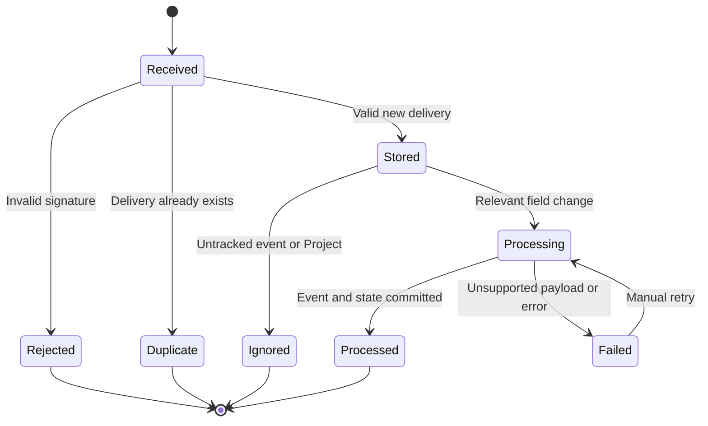
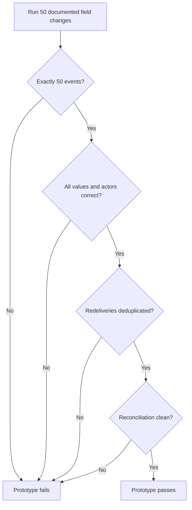
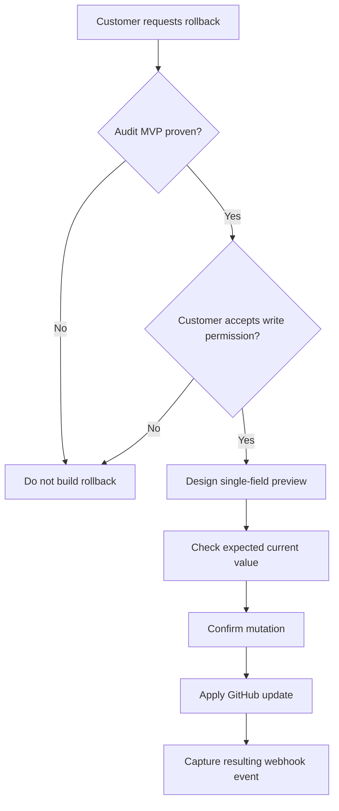

# GitHub Projects Audit History — MVP Flowcharts

These diagrams describe the prototype defined in the MVP specification. The product is read-only: it captures and displays Project V2 field changes but does not roll them back.

## 1. System context

## 2. Initial setup and baseline

The baseline represents the Project’s state when tracking begins. It must not be presented as historical user changes.

## 3. Webhook ingestion

## 4. Atomic event persistence

If normalization or persistence fails, the raw delivery remains available for diagnosis and retry. The application must never silently discard it.

## 5. Timeline query

Supported filters:

- Actor
- Item title or number
- Field
- Date range

## 6. Reconciliation

A reconciliation mismatch is evidence of state drift. It is not historical proof of who made the missing change or when. The product must not fabricate an audit event from a mismatch.

## 7. Delivery state machine

## 8. Prototype completion gate

## 9. Future rollback boundary

Rollback is phase two. It is not part of the prototype described here.

