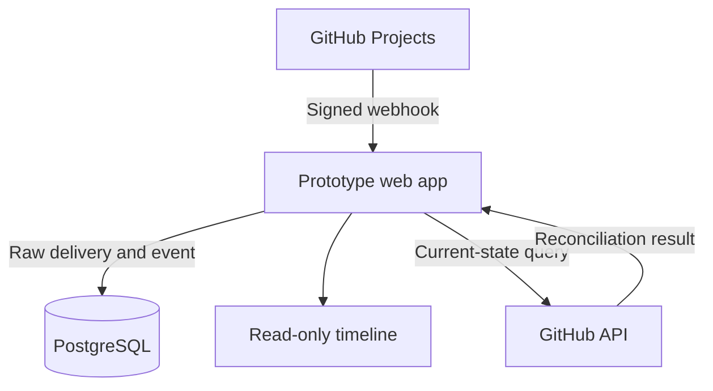

# GitHub Projects Audit History

## Lean MVP specification

**Version:** 0.1  
**Status:** Prototype-ready  
**Date:** August 12, 2026  
**Primary user:** Engineering manager or GitHub Projects administrator  
**Prototype boundary:** One GitHub organization and one organization-owned Project V2 board

> **Build decision:** Prove reliable, read-only audit history first. Do not implement rollback until event capture, ordering, identity, and reconciliation are proven.

## 1. Product thesis

### Problem

GitHub Projects exposes current Project V2 field values but does not provide a dependable, permanent, user-friendly history for every field change. Teams cannot easily answer:

- Who changed this field?
- What was its previous value?
- When did it change?
- Did an automation or a person change it?
- Can the team trust that the history is complete?

### Prototype hypothesis

A GitHub App can capture Project item field edits, preserve the original webhook evidence, normalize each change, and display a trustworthy timeline with less friction than custom webhook scripts or organization audit-log searches.

### Core proof

When someone changes a tracked field in the selected GitHub Project, the change appears once—and only once—in the prototype timeline with the correct:

- Organization and Project
- Project item
- Field
- Actor
- Previous value
- New value
- Event timestamp
- Link to the GitHub item

## 2. Prototype success criteria

The prototype is successful only if it can:

1. Capture 50 consecutive scripted field changes without losing or duplicating an audit event.
2. Support single-select, text, number, date, and iteration fields.
3. Display an accepted event within 10 seconds under normal test conditions.
4. Reject webhook requests with invalid signatures.
5. Deduplicate GitHub webhook redeliveries.
6. Survive an application restart without losing stored events.
7. Detect an intentionally introduced state mismatch during reconciliation.

> A polished dashboard without reliable event capture is a failed prototype.

## 3. Scope

### Included

- A manually created GitHub App installed on one test organization.
- Read-level organization `Projects` permission.
- Subscription to the `projects_v2_item` webhook event.
- One Project V2 node ID configured through an environment variable.
- An initial snapshot of the selected Project, its items, fields, and current values.
- Webhook receipt and signature verification.
- Raw webhook payload retention.
- Idempotent event processing.
- Normalized, append-only audit events.
- A read-only timeline with basic filters.
- A manual reconciliation command or protected endpoint.
- One prototype administrator password configured through the environment.

### Explicitly excluded

- Rollback or any mutation of GitHub data.
- Project write permission.
- Billing, subscriptions, trials, or GitHub Marketplace listing.
- Multi-tenant isolation or self-service onboarding.
- Teams, roles, invitations, SSO, or enterprise identity management.
- Slack, email, anomaly alerts, or scheduled reports.
- PDF evidence packages or compliance framework mappings.
- Configurable retention policies.
- Repository issue history such as labels, milestones, comments, and assignees.
- Historical reconstruction for changes made before installation.
- User-owned GitHub Projects.

## 4. Primary user journey

1. The developer creates the GitHub App manually.
2. The developer configures its callback URL, webhook URL, webhook secret, private key, organization `Projects: read` permission, and `projects_v2_item` subscription.
3. An organization owner installs the App on the test organization.
4. The developer configures the installation ID and target Project node ID.
5. The developer runs the baseline sync.
6. The prototype stores the Project, fields, items, and current values as baseline state—not as historical change events.
7. A test user changes an item field in GitHub Projects.
8. GitHub sends a webhook to the prototype.
9. The prototype verifies the signature and stores the raw delivery.
10. The prototype normalizes and appends one audit event.
11. The user opens the timeline and sees the change with a link back to GitHub.
12. The developer runs reconciliation and confirms the stored current state matches GitHub.

## 5. Functional requirements

| ID | Requirement | Acceptance condition |
|---|---|---|
| FR-01 | Receive Project V2 item webhooks | The endpoint accepts the configured event and supported action from the installed GitHub App. |
| FR-02 | Verify authenticity | A missing or invalid `X-Hub-Signature-256` returns `401` and creates no delivery or audit event. |
| FR-03 | Deduplicate deliveries | Redelivering the same `X-GitHub-Delivery` value does not create another audit event. |
| FR-04 | Filter the target Project | Events outside the configured Project are marked ignored rather than becoming audit events. |
| FR-05 | Preserve raw evidence | The original payload, delivery ID, event name, action, receive time, and processing outcome are stored. |
| FR-06 | Normalize field changes | A supported change produces one typed event containing its previous and current values. |
| FR-07 | Maintain current state | After processing, the stored current value matches the normalized new value. |
| FR-08 | Display a timeline | The newest-first list shows actor, item, field, before, after, and event time. |
| FR-09 | Filter the timeline | The user can filter by actor, item text, field, and date range. |
| FR-10 | Create a baseline | Initial sync stores current values without presenting them as historical user changes. |
| FR-11 | Reconcile state | A manual run compares stored current values with GitHub and reports mismatches. |
| FR-12 | Preserve unsupported payloads | Unknown field shapes remain available as raw deliveries and fail visibly rather than being discarded. |

## 6. Event-processing contract

For every webhook request:

1. Read the unmodified raw request body.
2. Validate `X-Hub-Signature-256` using HMAC-SHA256 and a constant-time comparison.
3. Extract `X-GitHub-Delivery`, `X-GitHub-Event`, action, installation, organization, Project item, sender, and change data.
4. Insert a webhook-delivery record using `X-GitHub-Delivery` as a unique idempotency key.
5. Return success after the delivery is durably stored.
6. Explicitly ignore unrelated events and Projects.
7. Normalize previous and current field values into a canonical JSON shape.
8. Insert an append-only audit event and update current state in one database transaction.
9. Mark the delivery as `processed`, `ignored`, or `failed`.
10. Preserve a human-readable error for failed processing.

Never silently discard a webhook delivery.

> Store the full raw payload before interpreting it. GitHub currently describes Projects webhooks as public preview and subject to change. Raw evidence is the recovery path if the normalizer breaks.

## 7. Canonical audit event

```json
{
  "event_id": "uuid",
  "delivery_id": "github-delivery-guid",
  "installation_id": 12345,
  "organization_login": "example-org",
  "project_node_id": "PVT_...",
  "project_item_node_id": "PVTI_...",
  "content_type": "Issue",
  "content_node_id": "I_...",
  "content_title": "Fix login timeout",
  "content_url": "https://github.com/example-org/example/issues/42",
  "field_node_id": "PVTF_...",
  "field_name": "Status",
  "field_type": "single_select",
  "previous_value": {
    "option_id": "option-1",
    "label": "In progress"
  },
  "current_value": {
    "option_id": "option-2",
    "label": "Done"
  },
  "actor_login": "octocat",
  "occurred_at": "2026-08-12T10:30:00Z",
  "received_at": "2026-08-12T10:30:02Z",
  "source": "github_webhook"
}
```

Nullable or unavailable values must be represented explicitly. Do not invent missing actors, timestamps, titles, or field labels.

## 8. Minimal data model

### `github_installations`

- `installation_id` primary key
- `organization_login`
- `created_at`

### `tracked_projects`

- `project_node_id` primary key
- `installation_id`
- `title`
- `url`
- `tracking_started_at`
- `last_synced_at`

### `project_fields`

- `field_node_id` primary key
- `project_node_id`
- `name`
- `type`
- `option_metadata_json`

### `project_items`

- `item_node_id` primary key
- `project_node_id`
- `content_node_id`
- `content_type`
- `title`
- `url`

### `current_values`

- `item_node_id`
- `field_node_id`
- `value_json`
- `observed_at`
- `source`
- Unique constraint on `item_node_id + field_node_id`

### `webhook_deliveries`

- `delivery_id` primary key
- `event_name`
- `action`
- `headers_json`
- `payload_json`
- `received_at`
- `processing_status`
- `processing_error`

### `audit_events`

- `event_id` primary key
- `delivery_id` unique
- Installation, organization, Project, item, content, field, and actor identifiers
- `previous_value_json`
- `current_value_json`
- `occurred_at`
- `received_at`
- `created_at`

`audit_events` is append-only. Application code must not expose update or delete operations for this table.

### `reconciliation_runs`

- `run_id` primary key
- `started_at`
- `completed_at`
- `checked_value_count`
- `mismatch_count`
- `details_json`

## 9. Lean architecture

Use one TypeScript web application, one PostgreSQL database, and one public HTTPS deployment. Do not split the prototype into separate services.



### Components

- **GitHub App:** installation identity, organization Projects read permission, webhook delivery, and installation access tokens.
- **Webhook endpoint:** raw-body capture, signature verification, durable delivery storage, and explicit responses.
- **Normalizer:** converts supported GitHub field changes into canonical audit events.
- **PostgreSQL:** stores raw deliveries, append-only events, dictionaries, current state, and reconciliation results.
- **Timeline UI:** displays audit events and filters without mutation controls.
- **Reconciler:** fetches current Project state through GitHub APIs and compares it with `current_values`.

### Reference stack

- TypeScript
- A single Node.js web framework, such as Next.js or Fastify
- PostgreSQL
- Octokit or another maintained GitHub App SDK
- Server-rendered HTML or a minimal React UI

The exact framework is not part of the product hypothesis. Do not spend prototype time comparing frameworks.

## 10. Minimal routes

| Method | Route | Purpose |
|---|---|---|
| `POST` | `/api/github/webhooks` | Receive and verify GitHub App webhooks. |
| `GET` | `/events` | Render the audit timeline and filters. |
| `GET` | `/api/events` | Return paginated normalized events. |
| `POST` | `/internal/baseline-sync` | Snapshot the configured Project. Protected prototype route. |
| `POST` | `/internal/reconcile` | Compare current state with GitHub. Protected prototype route. |
| `GET` | `/internal/deliveries/:id` | Inspect one delivery and its processing outcome. Protected prototype route. |
| `GET` | `/health` | Check application and database liveness. |

## 11. Timeline UI

### Page header

- Organization and Project title
- Tracking start time
- Last successful reconciliation
- Current mismatch and processing-error counts

### Filters

- Free-text item search
- Field
- Actor
- Date range

### Event row

- Event timestamp
- Actor login
- Item title
- Field name
- Previous value
- Direction arrow
- New value
- Link to the GitHub item

### Value rendering

- Select and iteration fields: human-readable label
- Date fields: ISO date
- Text and number fields: plain text
- Removed value: visible `Cleared` state
- Unknown value: visible `Unsupported value` state linked to the delivery debugger

### Prototype behavior

- Display 50 events per page.
- Poll every 5–10 seconds.
- Do not implement WebSockets or real-time streaming.
- Show an explicit empty state: `No changes captured since tracking began.`
- Show visible processing failures. Never hide them behind server logs.

## 12. Security and integrity requirements

- Request only organization `Projects: read` permission.
- Do not request Project write access.
- Store the GitHub App private key, webhook secret, database URL, and prototype admin password as environment secrets.
- Validate every webhook signature using the unmodified body.
- Use a database uniqueness constraint for webhook delivery IDs.
- Escape all GitHub-provided text before rendering it.
- Do not log private keys, installation tokens, webhook secrets, authorization headers, or full private payloads.
- Record GitHub event time and application receive time separately.
- Use installation access tokens only when required, and allow them to expire naturally.
- Restrict the delivery debugger, baseline sync, and reconciliation routes with the prototype administrator password.

## 13. Reconciliation

Reconciliation is necessary because webhook systems can experience delivery delays, duplication, processing failures, or missed events.

For the prototype, reconciliation may be manually triggered:

1. Obtain a GitHub App installation token.
2. Fetch the configured Project’s current items, fields, and field values.
3. Normalize them using the same canonical value format as webhook events.
4. Compare each GitHub value with `current_values`.
5. Store missing, changed, and unexpected values as mismatch details.
6. Do not automatically create historical events for unexplained mismatches.
7. Do not overwrite stored audit evidence.

A mismatch proves that current state drifted; it does not prove who changed it or when. The UI must not fabricate history from reconciliation results.

## 14. Acceptance test plan

| Test | Procedure | Expected result |
|---|---|---|
| T-01 Valid edit | Change Status from `Todo` to `Done`. | One correct event appears with actor, previous value, new value, and GitHub link. |
| T-02 Field types | Edit text, number, date, single-select, and iteration fields. | Each value is captured and rendered correctly. |
| T-03 Clear value | Remove a populated field value. | Current value renders as `Cleared`; previous value remains visible. |
| T-04 Redelivery | Redeliver the same webhook from GitHub. | No second audit event is created. |
| T-05 Invalid signature | Send a modified payload with a bad signature. | `401`; nothing is accepted. |
| T-06 Wrong Project | Edit a Project not configured for tracking. | No audit event; delivery is marked ignored. |
| T-07 Restart | Restart the application after events exist. | Prior events remain queryable. |
| T-08 Rapid edits | Make several quick edits to the same field. | Every delivery remains independently visible with event and receive timestamps. |
| T-09 Unsupported payload | Process an unsupported payload fixture. | Raw delivery is preserved and marked failed with an actionable error. |
| T-10 Reconciliation | Alter one `current_values` row in the test database, then reconcile. | The run reports the mismatch. |
| T-11 Baseline distinction | Run the initial snapshot on a populated Project. | Current values exist, but no fake historical events are created. |
| T-12 Fifty-change run | Execute 50 documented field changes. | Exactly 50 corresponding audit events exist with no unexplained drift. |

## 15. Five-day build sequence

### Day 1 — Signed evidence

- Create and install the GitHub App.
- Deploy the application skeleton.
- Connect PostgreSQL.
- Receive one real webhook.
- Verify its signature.
- Persist the raw payload and delivery headers.

**Exit condition:** One signed GitHub delivery is visible in the database.

### Day 2 — Audit event

- Add database-level idempotency.
- Filter to the target Project.
- Implement one field-change normalizer.
- Insert an append-only event.
- Update `current_values` transactionally.

**Exit condition:** A Status change produces one correct normalized event.

### Day 3 — Baseline and field coverage

- Implement installation-token generation.
- Fetch the target Project.
- Store fields, items, and baseline values.
- Add text, number, date, single-select, and iteration normalization.

**Exit condition:** The baseline matches GitHub and all supported field types can be captured.

### Day 4 — Usable timeline

- Build `/events`.
- Add actor, item, field, and date filters.
- Add GitHub links.
- Build the protected delivery debugger.
- Display processing failures.

**Exit condition:** A non-developer can inspect and understand captured changes.

### Day 5 — Trust test

- Implement reconciliation.
- Run the acceptance tests.
- Execute the 50-change test.
- Save representative payload fixtures.
- Record a two-minute product demo.

**Exit condition:** No unexplained missing or duplicate events remain.

## 16. Demo script

1. Open the timeline and show the configured organization, Project, and tracking start time.
2. Open GitHub Projects in another tab.
3. Change an issue’s Status from `In progress` to `Done`.
4. Return to the prototype and show the new event.
5. Point out the actor, timestamp, item, field, previous value, and new value.
6. Redeliver the webhook from GitHub.
7. Refresh the timeline and demonstrate that no duplicate appeared.
8. Change a date or text field and then clear it.
9. Show both transitions.
10. Run reconciliation and show zero mismatches.
11. Alter one test `current_values` row directly.
12. Rerun reconciliation and show the detected mismatch.

## 17. Rollback phase-two gate

Do not add rollback merely because GitHub exposes the `updateProjectV2ItemFieldValue` mutation. Rollback requires Project write permission and introduces concurrency, authorization, deleted-field, deleted-option, iteration, and partial-failure risks.

Rollback work may begin only when:

- All MVP acceptance tests pass.
- Reconciliation consistently explains current-state drift.
- At least three pilot customers explicitly request restoration.
- Those customers are willing to grant Project write access.
- The proposed rollback UX includes a preview and confirmation.
- The mutation checks that the current GitHub value still equals the expected value.
- Every rollback produces a new audit event.
- Partial failures are visible and retryable.

The first rollback version should restore one field on one item. Do not start with bulk rollback.

## 18. Known risks

| Risk | Prototype response |
|---|---|
| Projects webhooks are public preview and payloads may change. | Preserve raw payloads, version the normalizer, and fail visibly. |
| Webhooks can be delayed, duplicated, or missed. | Use delivery idempotency and reconciliation. Do not claim perfect completeness without evidence. |
| History begins only after installation. | Display tracking start time prominently and label the baseline as a snapshot. |
| Actor or item data may be unavailable or redacted. | Permit nullable identities and preserve raw evidence. |
| Rapid edits can make ordering ambiguous. | Store event time, receive time, delivery ID, and insertion order. |
| Users may not pay for history alone. | Validate with real installations and paid pilots before building rollback or compliance features. |
| GitHub may build native history. | Validate demand quickly and differentiate later through retention, reconciliation, exports, and safe restoration. |

## 19. Evidence and implementation references

- [GitHub: Webhook events and payloads](https://docs.github.com/webhooks/webhook-events-and-payloads)
- [GitHub: Using the API to manage Projects](https://docs.github.com/en/issues/planning-and-tracking-with-projects/automating-your-project/using-the-api-to-manage-projects)
- [GitHub: Validating webhook deliveries](https://docs.github.com/en/webhooks/using-webhooks/validating-webhook-deliveries)
- [GitHub: Webhook best practices](https://docs.github.com/en/webhooks/using-webhooks/best-practices-for-using-webhooks)
- [GitHub: Projects GraphQL mutations](https://docs.github.com/en/graphql/reference/projects)
- [GitHub Community: Project V2 webhook previous/current field values](https://github.com/orgs/community/discussions/17405)
- [GitHub Community: Request for custom-field change history](https://github.com/orgs/community/discussions/86690)

## 20. Final build instruction

Build this exact loop first:

> Signed webhook → durable raw delivery → normalized audit event → read-only timeline → reconciliation

Everything else waits.
